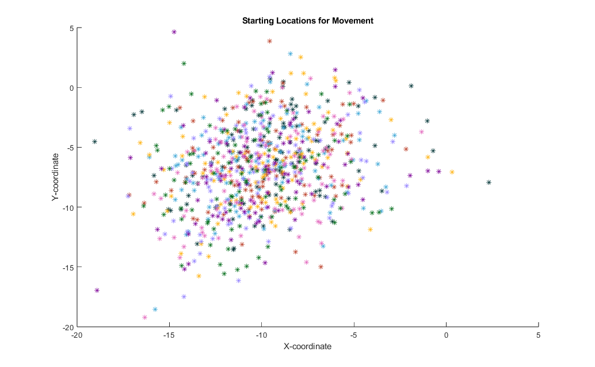
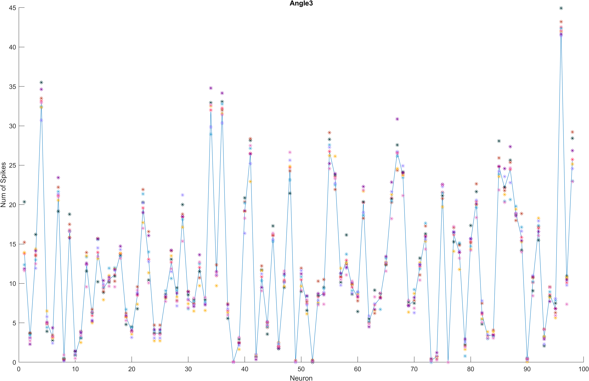
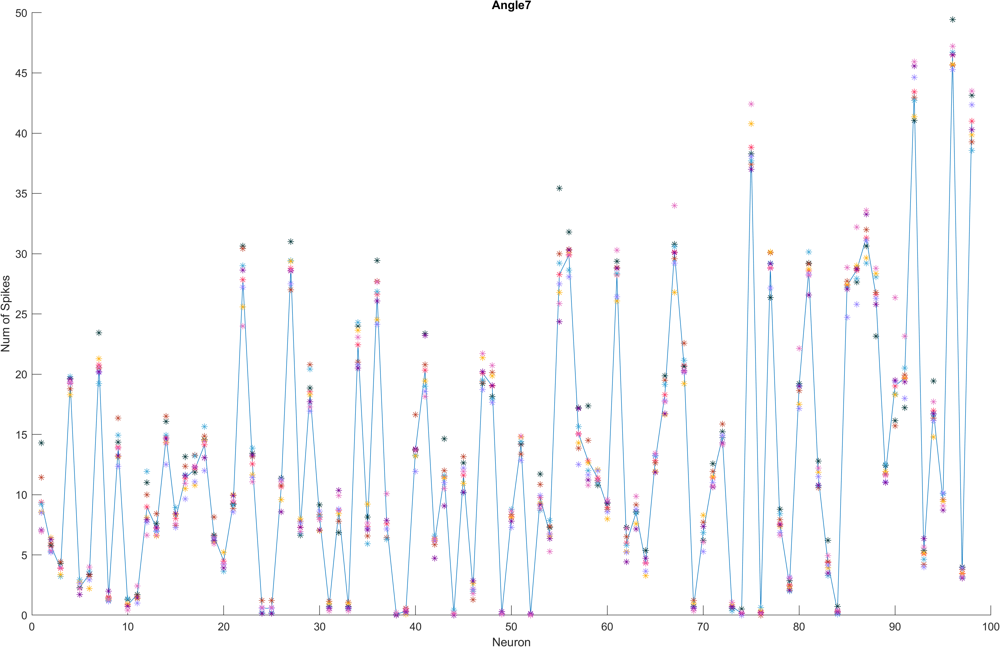
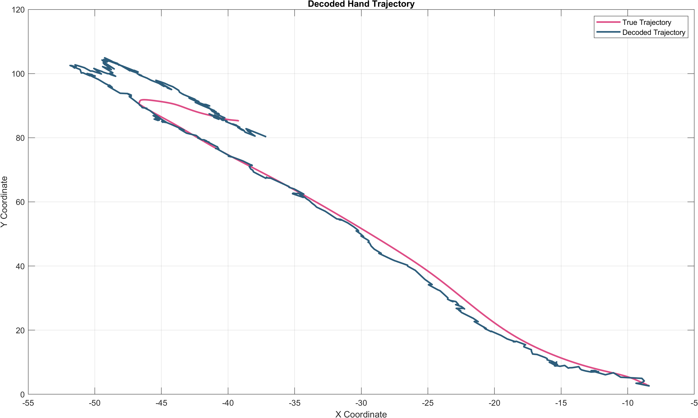
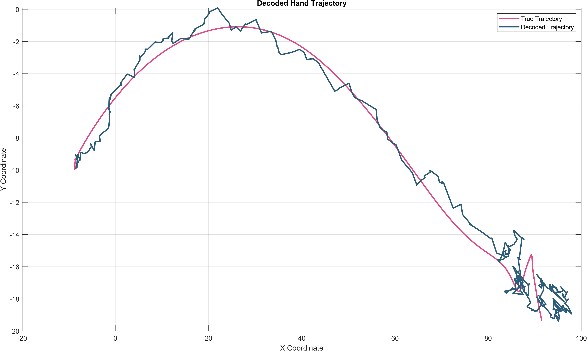

# Imperial_BMI
A location for the code generated as part of the Brain-Machine Interfaces coursework as part of the Imperial MSc Human &amp; Biological Robotics degree. 

# Initial Findings

Notable findings from known trajectories:

Starting locations are immensely varied (here colour-coded by angle); no meaningful correlation between intended direction of movement and initial starting location can be identified. Based on these locations, two possible approaches come to mind:

- Assume that the initial trajectory starting point is given and base further calculations of unknown trajectory from fixed location.
- Average starting locations of training data and assume that such an approximation is adequate for initial best guess. This solution would benefit from pre-movement neural analysis to see whether correlation exists between initial impulses and starting location.

Additionally:

 

Neural spike rates over entire trials are certainly dependent on direction, lending to potential vector-field extensions of implementations. Here plotted trial averages (connected), as well as local averages per neuron in 14-sample bins (standalone stars, 7 per neuron). Further imgs are in `./imgs/AnglesX.png`

Neuron firing rates remain highly consistent given dedicated direction of movement, with some standout benchmarks (neuron 4/5 and 68/69 appear highly consistent at first glance). However, significant inter-neuron noise is present with limited absolute changes in firing activity, meaning information extraction is likely implicit rather than explicit. 

This conclusion is further supported by the explicit separation of average firing rate depending on direction (only neurons 1-7 have been plotted before I got bored and moved on with my life):

.png "neuronsFire")

# Attempted solution

The code is in `./base/filter.m`. Initially intended as an expansion on regression and gradient methods, this has generally morphed into a base-version Kalman filter. 

As guessing future locations from noisy and inconsistent measurements results in the noise propogating through to the decoded messages, Kalman filters are something that I saw as handling that noise without necessarily degrading the estimation with overly long averaging windows. As Kalman filters introduce Gaussian uncertainty gradients as an inheirent part of the calculation process, the guesses for future states come with an uncertainty band that gradually collapses as more data is available. 

This approach discretely separates the estimation and prediction steps, potentially allowing for (limited) adjustment of either. However, variable dimensions for matrix operations have proven to be a major pain, so here's a quick breakdown of what the anticipated (so far functional) dimensions are, in terms of n states and m measurements:

- state (nx1, 4x1) = state vector (x,y,xdot,ydot)
- A (nxn, 4x4) = state transition model
- H (mxn, 98x4) = measurement model
- Q (nxn, 4x4) = process noise covariance
- R (mxm, 98x98) = measurement noise covariance
- P (nxn. 4x4) = state estimate uncertainty
- z (mx1. 98x1) = measurement vector

Further breakdowns for Kalman filters can be found [here](https://github.com/rlabbe/Kalman-and-Bayesian-Filters-in-Python/blob/master/11-Extended-Kalman-Filters.ipynb) and particularly [here](https://cheever.domains.swarthmore.edu/Ref/Kalman/MatrixKalman.html). 

# Preliminary results (I cannot stress this enough, I am unsure how much learning is happening vs artificially conflating trajectories)

Decoded paths for angle 3 and 8:

 

Decoding on my end took only a minute or two, but I have not run it on weaker hardware. YMMV. 

As mentioned above, since the model depends on error between the true and decoded trajectory, which for me was non-trivial to keep track of, it is quite possible that there is some level of conflation between true reference trajectory and the calculated one. I have done no testing. Like real software engineers, I blindly push to production.

# Further work

This is intended to work largely in conjunction with regression methods (the H matrix is calculated via least squares at the moment, but that can, and probably should, be replaced by a more robust model that doesn't stray dangerously close to singularity). 

No current use for pre-movement samples has been implemented. There is almost certainly some use from that information within the current context, I'm just not quite bright (or well rested) enough to see it yet. 

Movement estimation happens on a single time step basis. This should absolutely be adjusted in the future to utilise a moving window, I arbitrarily quite like one of 20ms. This should help smooth out some of the jittery-ness of the decoded path. 

Post-movement samples are likewise not accounted for. This likely leads to significant stuttering about once the arm has completed its movement as the model seeks to keep moving somewhere. I'm not entirely sure how to solve this causally. 

There is significant overshoot in any sort of sharp start/stop scenario, which is to be expected, as the current implementation assumes constant velocity. Acceleration can be accounted for, but that requires larger matrices, specifically for A and whichever onces are multiplied further down the line. I haven't done that because getting all my dimensionless ducks in a row caused crisis enough already. 